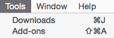

Paper 
=====

Simple Instapaper addon for Firefox. You can press toolbar button,
right-click menu option, or customizable hotkey to add current page
to Instapaper, or you can add links in bulk by shift-clicking them.
Supports notifications, off by default.

[Get it from Mozilla Addons][mozilla].

[mozilla]: https://addons.mozilla.org/en-US/firefox/addon/paper-for-instapaper/

Configure
---------

To use Paper, you need to provide your username and password. They are
sent only to Instapaper and only through an encrypted connection, but
they are both stored on your machine unencrypted.

Go to Tools→Add-ons or just press Shift+Command+A on Mac or Ctrl+Shift+A
on Windows/Linux:

Then you will see the Paper addon in the list. Click on “Preferences” button
and fill the form:

Shift-clicking on a link adds it to Instapaper by default. You can change
the modifier key, or turn the feature off altogether to make your browser
a very little bit faster.

When you are finished with settings, go try to send [some article][article].
Press the ![Send to Instapaper][default] button and if your credentials are OK,
it will change to ![the tick][success]. If it didn't, double check your preferences.

[default]: data/default.png
[success]: data/success.png

If you have any trouble with the addon, [write me back][email].

[article]: http://www.rollingstone.com/culture/features/ben-schlappig-airlines-fly-free-20150720
[email]: mailto:mail@yegortimoshenko.com

Credits
-------

Inspired by [InstapaperIt][instapaperit] for Safari. ![Instapaper icon][default]
and ![tick][success] are taken from there with the author's permission.

[instapaperit]: http://elasticthreads.tumblr.com/post/675433975/safari-extensions

### 

The logo is based on the [Farm-Fresh newspaper][source] icon by [FatCow Web Hosting](http://www.fatcow.com/free-icons/) under [CC BY 3.0][cc] license.

[cc]: https://creativecommons.org/licenses/by/3.0/us/deed.en
[fatcow]: http://www.fatcow.com/free-icons/
[source]: https://commons.wikimedia.org/wiki/File:Farm-Fresh_newspaper.png
